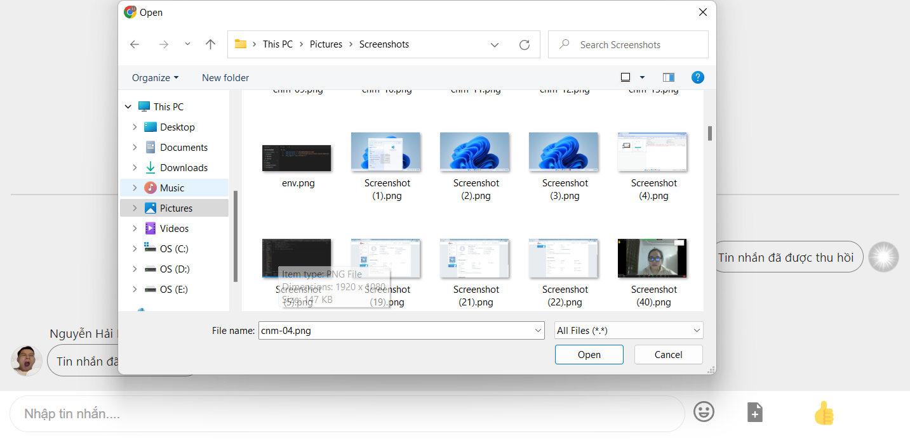

# Project: App Chat 

### Technology in project
<!--     - Web back-end:
        - NodeJS
        - SocketIO
        - AWS EC2
        - AWS S3
        - Firebase Authentication -->
    - Web front-end:
        - ReactJS 
        - SocketIO
        - Firebase Authentication
### Feature
    - Login
    - Register
    - Verify account by firebase
    - Search user by name / by phone number
    - Chat:
        + Text, image file, video file, emoji
        + Recover message
    - Video call
    - Change info user
    - Add friend / block user
    - Create group, join group 
    - Manager group
    - Manager file in chat

### Over View
##### UI Login

##### UI Register

#### UI Verify

#### UI Homepage

#### Chat

#### Video call

#### Creategroup

#### Info user

#### Change info user

#### List friend

#### List group

#### search user

